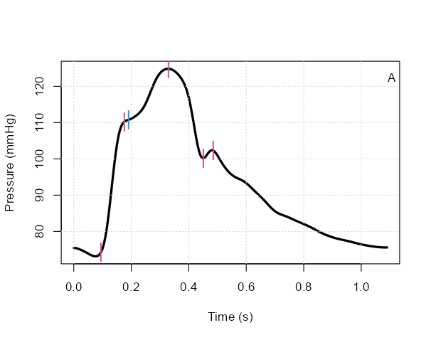
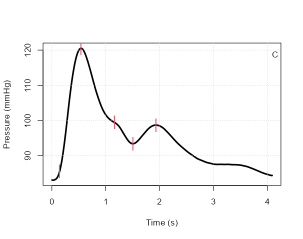

# PulseWaveAnalysis

This R script provides a way to derive some basic pulse wave analysis indcies from an ensembled pressure waveform sampled at 200 Hz. Values expressed in seconds (.sec) represent the time from the start of the pressure signal and are thus dependent on the method used to average the pressure waveforms (ie. does the averaged pressure waveform start at the ECG R wave or some other feducial marker such as the pressure waveform foot).

Example plots:

Murgo type A waveform:

Murgo type C waveform:

